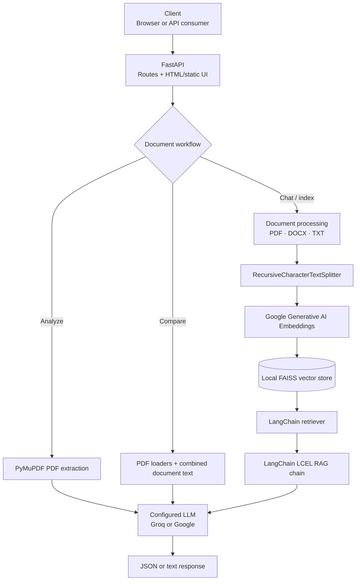
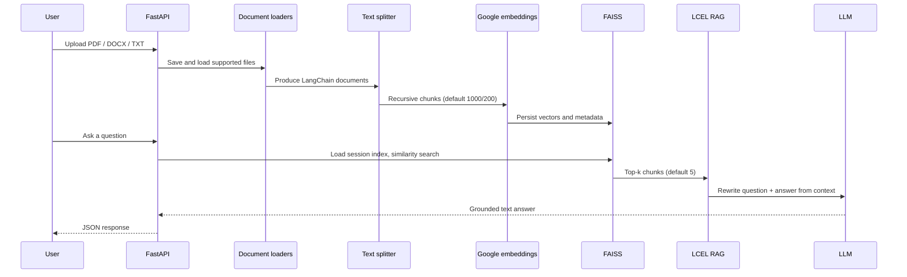
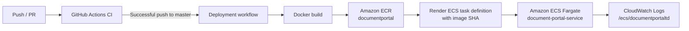
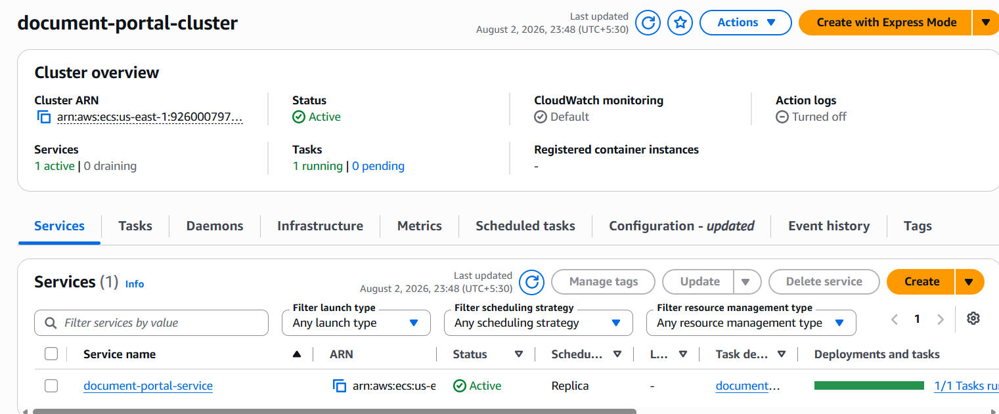
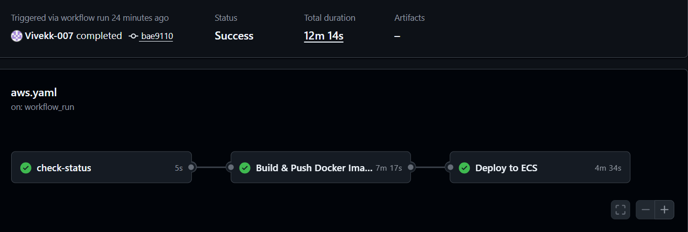
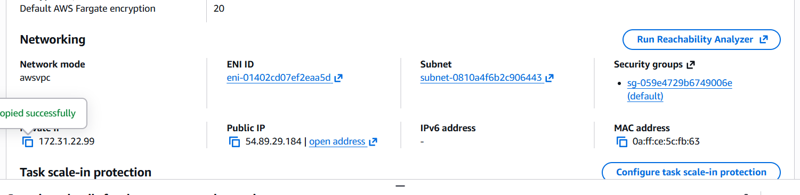
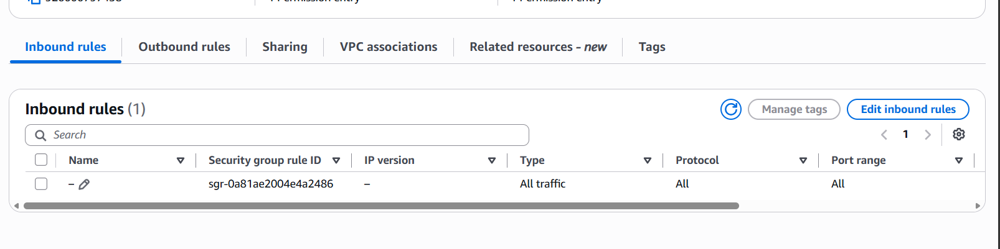

# Document Portal

> An AI-powered FastAPI application for extracting structured metadata from PDFs, comparing two PDFs page by page, and asking grounded questions across uploaded PDF, DOCX, and TXT files.

▶️ **[Watch the project demo on YouTube](https://youtu.be/bNMajzc47Lw?si=KGgJwNhlfe3KxElr)**

[](https://www.python.org/)
[](https://fastapi.tiangolo.com/)
[](https://www.docker.com/)
[](https://aws.amazon.com/ecs/)
[](.github/workflows/ci.yaml)
[](#license)
[](#overview)

## Overview

Document Portal brings three document-centric workflows behind one web and HTTP interface:

- **Analyze** a PDF into structured metadata, summary, and document attributes.
- **Compare** a reference and actual PDF, returning LLM-generated page-level changes.
- **Chat** with one or more documents using retrieval-augmented generation (RAG).

It exists to make unstructured document content more searchable and actionable without building a separate interface for each task. It is intended for teams and developers evaluating AI-assisted document review, document intelligence, and local FAISS-backed RAG workflows.

## Features

- FastAPI application with a browser UI served at `/` and a health endpoint.
- PDF analysis with structured JSON output: title, authors, dates, publisher, language, page count, sentiment/tone, and summary fields.
- PDF-to-PDF comparison that returns page-wise changes in tabular JSON.
- Multi-file document chat for **PDF**, **DOCX**, and **TXT** uploads.
- Configurable RAG chunk size, chunk overlap, and top-*k* retrieval.
- Session-scoped upload and FAISS-index directories, with caller-supplied or generated session IDs.
- Local FAISS persistence and duplicate-suppression metadata for ingested document chunks.
- LangChain LCEL pipeline for question rewriting, retrieval, and context-grounded answers.
- Selectable Groq or Google chat models through configuration and `LLM_PROVIDER`.
- Structured JSON logging to stdout and timestamped files under `logs/`.
- Docker image definition, GitHub Actions CI, and an ECS Fargate deployment workflow.

## Architecture



| Component | Implementation | Responsibility |
| --- | --- | --- |
| Client | `templates/index.html`, `static/style.css` | Browser tabs and `fetch` requests for analysis, comparison, indexing, and questions. |
| API | `api/main.py` | Serves the UI/static assets and exposes HTTP endpoints. CORS currently permits all origins, methods, and headers. |
| Document processing | `utils/document_ops.py`, `src/document_ingestion/data_ingestion.py` | Saves uploads; loads PDFs, DOCX files, and text files; extracts pages; and splits chat documents into chunks. |
| LangChain | Prompts, output parsers, LCEL | Runs analysis/comparison chains and the conversational RAG pipeline. |
| LLM | Groq or Google Generative AI | Generates analysis, comparisons, question rewrites, and answers. The provider is selected by `LLM_PROVIDER`. |
| Embeddings | `GoogleGenerativeAIEmbeddings` | Converts document chunks to vectors. The configured model name is read from `config/config.yaml`. |
| Vector store | FAISS on the local filesystem | Persists `index.faiss`, `index.pkl`, and ingestion metadata, optionally per session. |
| Observability | `structlog` | Emits JSON logs to console and a timestamped local log file. |

> **Important:** Although the YAML labels the embedding provider as Hugging Face, the running code instantiates Google Generative AI embeddings. The code is the source of truth for this README.

## Tech Stack

| Area | Technology in this repository |
| --- | --- |
| Backend | Python 3.11, FastAPI, Uvicorn |
| Frontend | Server-rendered HTML, vanilla JavaScript, CSS |
| AI/LLM | LangChain, LangChain Core/Community, Groq (`llama-3.3-70b-versatile`), Google Gemini (`gemini-2.0-flash`) |
| Embeddings | Google Generative AI embeddings (model name from YAML configuration) |
| Vector Store | FAISS (`faiss-cpu`) |
| Database | No relational or external database is configured; FAISS and metadata are stored locally |
| Document Processing | PyMuPDF, PyPDF, LangChain loaders, `docx2txt` |
| Cloud | Amazon ECR and Amazon ECS Fargate workflow/task definition |
| CI/CD | GitHub Actions, `uv`, pytest |
| Containerization | Docker, Python 3.11 slim image |
| Monitoring & Logging | CloudWatch Logs in ECS task definition; local structured logs via `structlog` |

## Project Structure

```text
Document-Portal/
├── .github/workflows/
│   ├── ci.yaml                   # Dependency install, app-import verification, pytest
│   ├── aws.yaml                  # Build/push to ECR and deploy to ECS Fargate
│   └── task_definition.json      # ECS Fargate task definition
├── api/
│   └── main.py                   # FastAPI app and all HTTP routes
├── config/
│   └── config.yaml               # LLM, embedding, and retriever defaults
├── exception/
│   └── custom_exception.py       # Context-rich application exception
├── logger/
│   └── custom_logger.py          # JSON console/file logging configuration
├── model/
│   └── models.py                 # Pydantic output models and prompt enum
├── notebook/
│   ├── data/sample.pdf           # Sample notebook document
│   └── *.ipynb                   # Exploration, logging, and exception notebooks
├── prompt/
│   └── prompt_library.py         # Analysis, comparison, rewrite, and QA prompts
├── src/
│   ├── document_analyzer/        # PDF metadata/summary chain
│   ├── document_chat/            # Conversational LCEL RAG chain
│   ├── document_compare/         # LLM comparison chain and DataFrame formatting
│   └── document_ingestion/       # Upload persistence, splitting, and FAISS management
├── static/style.css              # Browser UI styles
├── templates/index.html          # Browser UI and API calls
├── tests/                        # Existing route/unit test modules
├── utils/                        # Configuration, models, upload adapters, document helpers
├── Dockerfile                    # Production container build
├── pyproject.toml                # Project metadata and pinned dependencies
├── uv.lock                       # Locked Python dependency graph
└── version.py                    # Installed-package version reporter
```

Runtime directories such as `data/`, `faiss_index/`, and `logs/` are created or populated during use and are ignored by Git. `streamlit_ui.py` is present but empty; the shipped UI is the FastAPI-served HTML page.

## Installation

### Prerequisites

- Python **3.11**
- [`uv`](https://docs.astral.sh/uv/) (the project’s lockfile and CI use it)
- A Google API key for embeddings, plus a Groq or Google key for the selected chat provider

```bash
git clone https://github.com/Vivekk-007/Document-Portal.git
cd Document-Portal

# Create/sync the Python environment from the locked dependency graph
uv sync --frozen
```

`uv` creates and manages `.venv` automatically. For a conventional virtual environment instead:

```bash
python -m venv .venv

# PowerShell
.\.venv\Scripts\Activate.ps1

# macOS/Linux
source .venv/bin/activate

python -m pip install .
```

`uv sync --frozen` is the repository-supported install path because it respects the committed lockfile.

Create a root `.env` file for local development:

```dotenv
GROQ_API_KEY=your_groq_key
GOOGLE_API_KEY=your_google_key
LLM_PROVIDER=groq
ENV=local
```

Run the service:

```bash
uv run uvicorn api.main:app --reload --host 0.0.0.0 --port 8080
```

Open [http://localhost:8080](http://localhost:8080). FastAPI’s generated OpenAPI docs are available at [http://localhost:8080/docs](http://localhost:8080/docs).

### Docker

```bash
docker build -t document-portal .
docker run --rm -p 8080:8080 \
  -e ENV=production \
  -e GROQ_API_KEY=your_groq_key \
  -e GOOGLE_API_KEY=your_google_key \
  -e LLM_PROVIDER=groq \
  document-portal
```

The image exposes port `8080` and starts Uvicorn with four workers. There is no `docker-compose.yml` in the repository.

## Environment Variables

| Variable | Required | Default | Purpose |
| --- | --- | --- | --- |
| `GROQ_API_KEY` | Yes* | — | Groq credential. The current `ApiKeyManager` requires it even when Google is selected as the LLM provider. |
| `GOOGLE_API_KEY` | Yes | — | Used by the embedding model and Google LLM provider. |
| `API_KEYS` | Optional alternative | — | JSON object containing **both** `GROQ_API_KEY` and `GOOGLE_API_KEY`; takes precedence over individual variables. |
| `LLM_PROVIDER` | No | `groq` | Selects `groq` or `google` from `config/config.yaml`. |
| `ENV` | No | `local` | `local` loads `.env`; `production` does not. |
| `FAISS_BASE` | No | `faiss_index` | Base directory for persisted chat indexes. |
| `UPLOAD_BASE` | No | `data` | Base directory for uploaded chat files. |
| `FAISS_INDEX_NAME` | No | `index` | FAISS index name used while loading chat indexes. |
| `DATA_STORAGE_PATH` | No | `data/document_analysis` under the working directory | Base directory for PDF-analysis uploads. |

\*Required by the application’s current startup logic. Do not commit `.env`; it is already ignored by Git.

## Running the Application

| Mode | Command |
| --- | --- |
| Development | `uv run uvicorn api.main:app --reload --host 0.0.0.0 --port 8080` |
| Production (host) | `uv run uvicorn api.main:app --host 0.0.0.0 --port 8080 --workers 4` |
| Docker | `docker run --rm -p 8080:8080 --env-file .env document-portal` |
| Test suite | `uv run pytest tests/ -v` |

## API Documentation

All endpoints are currently unauthenticated. File and form endpoints use `multipart/form-data`.

| Method | Route | Purpose | Request | Response | Authentication |
| --- | --- | --- | --- | --- | --- |
| `GET` | `/` | Serves the document portal browser UI. | None | HTML | None |
| `GET` | `/health` | Lightweight liveness check. | None | `{"status":"ok","service":"document-portal"}` | None |
| `POST` | `/analyze` | Extracts a PDF and invokes the structured analysis chain. | `file`: PDF upload | JSON metadata/summary object | None |
| `POST` | `/compare` | Compares a reference and actual PDF. | `reference`, `actual`: PDF uploads | `{"rows":[{"Page":"…","Changes":"…"}],"session_id":"…"}` | None |
| `POST` | `/chat/index` | Uploads documents and builds/updates a FAISS index. | `files` (one or more PDF/DOCX/TXT), optional `session_id`, `use_session_dirs`, `chunk_size`, `chunk_overlap`, `k` | `{"session_id":"…","k":5,"use_session_dirs":true}` | None |
| `POST` | `/chat/query` | Queries a previously created FAISS index. | `question`, optional `session_id`, `use_session_dirs`, `k` | `{"answer":"…","session_id":"…","k":5,"engine":"LCEL-RAG"}` | None |

<details>
<summary>Example requests</summary>

```bash
# Analyze a PDF
curl -X POST http://localhost:8080/analyze \
  -F "file=@./document.pdf"

# Compare two PDFs
curl -X POST http://localhost:8080/compare \
  -F "reference=@./reference.pdf" \
  -F "actual=@./actual.pdf"

# Create a session-scoped chat index
curl -X POST http://localhost:8080/chat/index \
  -F "files=@./handbook.pdf" \
  -F "files=@./notes.docx" \
  -F "chunk_size=1000" \
  -F "chunk_overlap=200" \
  -F "k=5"

# Ask a question using the returned session_id
curl -X POST http://localhost:8080/chat/query \
  -F "question=What are the key deadlines?" \
  -F "session_id=session_YYYYMMDD_HHMMSS_xxxxxxxx" \
  -F "use_session_dirs=true" \
  -F "k=5"
```

</details>

## Document Processing Flow



1. **Upload:** Chat accepts PDF, DOCX, and TXT; analysis and comparison accept PDFs only. Files are stored under `data/` by default.
2. **Parsing:** PDFs use `PyPDFLoader` for chat and PyMuPDF for analysis. DOCX and TXT use LangChain loaders.
3. **Chunking:** `RecursiveCharacterTextSplitter` uses caller-provided values, defaulting to 1,000 characters with 200-character overlap.
4. **Embedding:** Chunks are embedded with `GoogleGenerativeAIEmbeddings`.
5. **Storage:** FAISS indexes are saved locally; session mode writes beneath `faiss_index/<session_id>/`.
6. **Retrieval:** The query endpoint reloads FAISS and performs similarity retrieval using the requested `k`.
7. **Generation:** LCEL first rewrites the question using supplied history, then answers using retrieved context. The API currently invokes it with an empty chat history.
8. **Memory:** The prompt supports `chat_history`, but no server-side conversation-memory store is implemented.

## AI Pipeline

| Stage | Current behavior |
| --- | --- |
| Embeddings | `ModelLoader.load_embeddings()` creates Google Generative AI embeddings using the model name configured in `config/config.yaml`. |
| Retriever | FAISS `similarity` retriever with `k=5` by default; configurable per index/query request. |
| Chunking | `RecursiveCharacterTextSplitter`; defaults are 1,000 chunk size and 200 overlap. |
| Prompt engineering | Prompts enforce JSON-oriented analysis/comparison output, rewrite follow-up questions, and constrain RAG answers to retrieved context and three sentences. |
| LLM | Groq by default (`llama-3.3-70b-versatile`) or Google (`gemini-2.0-flash`) when selected. |
| Parsing | `JsonOutputParser` plus `OutputFixingParser` for analysis; comparison returns parsed JSON transformed to a pandas DataFrame. |
| RAG | Question rewrite → similarity retrieval → formatted context → answer generation via LangChain LCEL. |

## Deployment

The repository includes an ECS Fargate task definition and a GitHub Actions deployment workflow for `us-east-1`.



### Docker and AWS resources

- The Docker image is based on `python:3.11-slim`, installs `uv`, runs `uv sync --frozen --no-dev`, exposes `8080`, and starts four Uvicorn workers.
- The ECS task uses `awsvpc` networking, Fargate compatibility, 1 vCPU, 8 GiB memory, and port `8080`.
- The task definition supplies `ENV=production`, uses `ecsTaskExecutionRole`, and configures the `awslogs` driver for CloudWatch Logs.
- The CD workflow builds an image tagged with the commit SHA, pushes it to ECR, renders the task definition, and waits for the ECS service to stabilize.

### IAM and secrets configuration note

The deployment workflow authenticates with `AWS_ACCESS_KEY` and `AWS_SECRET_ACCESS_KEY` GitHub secrets. The ECS task definition references an AWS Secrets Manager secret as environment variable `API_KEY`. The application, however, reads `API_KEYS` (JSON) or `GROQ_API_KEY` and `GOOGLE_API_KEY`. Align the task-definition secret name/value with those application variables before relying on the ECS deployment for runtime credentials.

## GitHub Actions

### CI — `.github/workflows/ci.yaml`

Runs on pushes and pull requests targeting `master` or `main`:

1. Checks out the repository with `actions/checkout@v4`.
2. Sets up Python 3.11 with `actions/setup-python@v5`.
3. Installs `uv` with `astral-sh/setup-uv@v3`.
4. Installs locked dependencies with `uv sync --frozen --all-extras`.
5. Imports the FastAPI application to verify it can initialize.
6. Runs `pytest tests/ -v`.

### CD — `.github/workflows/aws.yaml`

Runs after the CI workflow completes successfully on the `master` branch:

1. Checks the source CI run’s status and branch.
2. Configures AWS credentials from repository secrets.
3. Logs in to ECR using `aws-actions/amazon-ecr-login@v2`.
4. Builds and pushes a commit-SHA-tagged Docker image.
5. Renders the ECS task definition with that immutable image URI.
6. Deploys the rendered task definition to the configured ECS service and waits for stability.

## Security

- **Secrets:** Local keys are loaded from `.env` only outside production. Production secrets should be injected by the platform, such as ECS Secrets Manager integration.
- **API keys:** Keys are never intentionally written to the README or Git-tracked configuration. The current logger only records a short masked prefix when keys load; review this behavior against your logging policy.
- **IAM:** ECS uses an execution role specified in the task definition. CI presently uses long-lived AWS access-key secrets rather than OIDC role assumption.
- **HTTP access:** No endpoint authentication or authorization is implemented, and CORS permits all origins. Do not expose this deployment publicly without an authentication/authorization layer and a restrictive CORS policy.
- **Uploads:** File-type filtering exists, but uploaded content is written to local disk. Add size limits, malware scanning, tenancy controls, and retention policies for production use.
- **Docker:** The image uses a slim base and excludes local virtual environments, Git metadata, logs, data, and indexes via `.dockerignore`. It does not currently declare a non-root user.

## Performance

- FastAPI route handlers are declared `async`, while the document parsing, FAISS persistence, embedding, and LLM operations they call are synchronous.
- The production Docker command uses four Uvicorn workers.
- Chat indexing accepts several files in one request, but there is no explicit embedding batch-size configuration or job queue.
- FAISS indexes are persisted and reused across queries; no in-memory cache or distributed cache is implemented.
- Session directories scope index data, but no automatic cleanup or memory-retention policy is implemented.

## Logging and Error Handling

`logger/custom_logger.py` configures `structlog` with ISO UTC timestamps, log levels, and JSON rendering. Events go to stdout and a timestamped file under `logs/`. The ECS definition sends container logs to CloudWatch Logs.

Application components wrap failures in `DocumentPortalException`, which captures the last traceback location and preserves an error message. API route handlers log exceptions and return `HTTP 500` JSON responses; expected chat validation errors return `400` (missing session ID in session mode) or `404` (missing FAISS index).

## Screenshots

### Amazon ECS Fargate deployment

| Active ECS cluster and service | Successful GitHub Actions deployment |
| --- | --- |
|  |  |

| Fargate task networking | Security group inbound rules |
| --- | --- |
|  |  |

> **Security note:** These screenshots capture the current AWS console configuration, including a task public IP and a security group rule allowing all inbound traffic. For a production deployment, restrict inbound access to the application port and trusted sources, and place the service behind an appropriate load balancer or private network boundary.

### Application UI

Add repository-hosted captures here when available:

| Document analysis | Document comparison | Document chat |
| --- | --- | --- |
| _Add `docs/screenshots/analysis.png`_ | _Add `docs/screenshots/compare.png`_ | _Add `docs/screenshots/chat.png`_ |

## Future Improvements

- Add API authentication, authorization, rate limiting, upload limits, and restrictive CORS defaults.
- Correct the ECS secret-to-environment-variable mapping and adopt GitHub OIDC with scoped IAM roles.
- Add integration tests that mock LLM/embedding providers and cover every API route.
- Persist conversation history or accept it in the API so the existing contextualization prompt can use real multi-turn memory.
- Move long-running uploads/indexing to background jobs and add operational cleanup for uploads and per-session FAISS indexes.
- Add source citations and document/page metadata to RAG answers.
- Add a `LICENSE` file, repository screenshots, API schemas/examples, and observability metrics/tracing.

## Contributing

Contributions are welcome.

1. Fork the repository and create a focused branch.
2. Install dependencies with `uv sync --frozen` and configure local keys in `.env`.
3. Keep changes scoped, type-conscious, and consistent with existing module boundaries.
4. Add or update tests for behavioral changes.
5. Run `uv run pytest tests/ -v` before opening a pull request.
6. In the PR description, explain the problem, approach, validation, and any configuration/deployment impact. Never include secrets or generated indexes/uploads.

## License

No license file is currently included in this repository. To release it under the **MIT License**, add a `LICENSE` file containing the standard MIT text and update the badge above to link to it.

## Author

Maintained by the project author. Add the maintainer’s GitHub profile here when publishing, for example: `[@github-handle]([https://github.com/your-github-handle](https://github.com/Vivekk-007))`.
